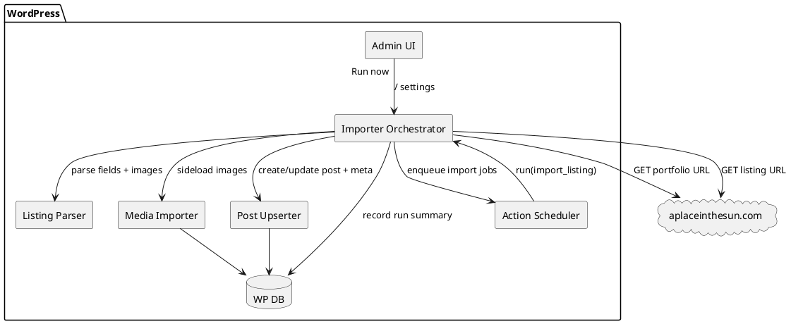

# SPEC-1-APITS-Mortify-Importer

## Background

a WordPress plugin (**APITS-Mortify-Importer**) that mirrors your public property portfolio on A Place in the Sun (APITS) into your WordPress site by creating one WordPress post per listing and copying over all listing content and images.

The source portfolio page currently shows ~89 listings for **DCTS Real Estate Development LLC** and each listing has its own detail page (e.g. `.../property/details/ap4093139/...`). ([aplaceinthesun.com](https://www.aplaceinthesun.com/property/agent/521573/dcts-real-estate-development-llc))

## Requirements

### Must have

- Import all listings from the portfolio URL and keep them in sync over time (new, updated, removed). ([aplaceinthesun.com](https://www.aplaceinthesun.com/property/agent/521573/dcts-real-estate-development-llc))
- Create/Update a dedicated **WordPress post** for each listing.
- Replicate listing content “fully”:
  - Title, location, price(s), beds/baths, sizes, features list, full description text. ([aplaceinthesun.com](https://www.aplaceinthesun.com/property/details/ap4093139/2-bed-apartment-for-sale-in-hurghada-red-sea-riviera-sinai-egypt))
  - Download and attach all listing images into the WordPress Media Library, set a featured image, and insert a gallery in the post.
- De-duplication: do not create duplicates across re-runs; updates should modify the existing post.
- Admin UI in WP:
  - Configure source portfolio URL
  - Run manual import
  - View last run status + errors
- Safe execution:
  - Respectable rate-limiting/backoff
  - Resumable imports (don’t restart from scratch if interrupted)

### Should have

- Mapping into custom fields (ACF-compatible) for structured data (price, beds, location, source URL, source listing ID).
- Optional taxonomy mapping (Country/Region/City, Property Type).
- WP-Cron scheduled sync (e.g., daily) + on-demand sync.
- “Unpublish” or “Archive” a WordPress post if a listing disappears from APITS.

### Could have

- WP-CLI command for bulk import (`wp apits-mortify import`).
- Image optimization hooks (WebP generation, responsive sizes).
- Duplicate detection for listings that change URLs but keep a stable source reference.

### Won’t have (for MVP)

- Two-way sync back to APITS (WP → APITS).
- Advanced editorial workflow beyond draft/publish toggles.

## Method

### High-level approach

APITS-Mortify-Importer will run a **read-only sync** from the public APITS agent portfolio page to WordPress.

- **Source of truth:** APITS listing detail pages (e.g., `.../property/details/ap4093139/...`). ([aplaceinthesun.com](https://www.aplaceinthesun.com/property/details/ap4093139/2-bed-apartment-for-sale-in-hurghada-red-sea-riviera-sinai-egypt))
- **Discovery:** fetch the agent portfolio page and extract all “More Details” listing URLs under the results section (the page renders the listings, not just JS placeholders). ([aplaceinthesun.com](https://www.aplaceinthesun.com/property/agent/521573/dcts-real-estate-development-llc))
- **Sync:** for each listing URL, fetch and parse structured fields + image URLs, then upsert a WordPress post.

Because a full import can involve ~89 listings and many images, the plugin uses a **job queue** rather than doing everything in one request.

Recommended job runner: **Action Scheduler** (bundled as a library dependency or required plugin) because it’s designed for scalable background processing in WP plugins. ([wordpress.org](https://wordpress.org/plugins/action-scheduler/?utm_source=chatgpt.com))

### WordPress data model

#### Content types

- **Custom Post Type:** `apits_property` (publicly queryable, has title/editor/excerpt/thumbnail).
- **Taxonomies (optional but strongly recommended):**
  - `apits_country`, `apits_region`, `apits_city`
  - `apits_property_type` (Apartment, Villa, Duplex, Condo, etc.)

#### Post meta (minimum)

| meta key | type | purpose |
|---|---:|---|
| `_apits_source_url` | string | canonical APITS listing URL |
| `_apits_listing_ref` | string | APITS “Ref” such as `AP4093139` parsed from page title/heading ([aplaceinthesun.com](https://www.aplaceinthesun.com/property/details/ap4093139/2-bed-apartment-for-sale-in-hurghada-red-sea-riviera-sinai-egypt)) |
| `_apits_agent_id` | string/int | `521573` (from portfolio URL) ([aplaceinthesun.com](https://www.aplaceinthesun.com/property/agent/521573/dcts-real-estate-development-llc)) |
| `_apits_hash` | string | content hash to detect changes |
| `_apits_last_seen_at` | datetime | for archiving missing listings |
| `_apits_price_gbp` | int | numeric price in GBP where present |
| `_apits_price_alt` | string | e.g. `[$94,847]` or `[€59,542]` when present ([aplaceinthesun.com](https://www.aplaceinthesun.com/property/agent/521573/dcts-real-estate-development-llc)) |
| `_apits_beds` / `_apits_baths` | int | numbers (if present) ([aplaceinthesun.com](https://www.aplaceinthesun.com/property/agent/521573/dcts-real-estate-development-llc)) |
| `_apits_location_country` / `_apits_location_region` / `_apits_location_city` | string | derived from breadcrumb line ([aplaceinthesun.com](https://www.aplaceinthesun.com/property/agent/521573/dcts-real-estate-development-llc)) |
| `_apits_image_ids` | json array<int> | WP attachment IDs imported for the post |

> If you use ACF, the plugin will optionally write the same values into configured ACF field keys.

#### Custom tables (for resumability & observability)

We add 2 small tables to avoid abusing postmeta for queue state and to make retries/resumes clean.

**Table 1: `wp_apits_mortify_import_runs`**

- `id` (bigint PK)
- `started_at`, `finished_at`
- `trigger` enum(`manual`,`cron`,`cli`)
- `status` enum(`running`,`success`,`failed`,`partial`)
- `total_discovered`, `total_processed`, `total_created`, `total_updated`, `total_failed`, `total_archived`
- `last_error` text

**Table 2: `wp_apits_mortify_jobs`**

- `id` (bigint PK)
- `run_id` (FK)
- `job_type` enum(`discover`,`import_listing`,`finalize`)
- `payload_json` (text) — e.g. `{ "url": ".../ap4093139/..." }`
- `status` enum(`queued`,`running`,`success`,`failed`,`retrying`)
- `attempts` int
- `last_error` text
- `locked_until` datetime (simple DB lock to prevent double-processing)

> If Action Scheduler is used, `wp_apits_mortify_jobs` becomes optional; Action Scheduler’s tables already track jobs. In that case, we keep only `..._import_runs`.

### Sync algorithm

#### 1) Discovery phase (agent portfolio → listing URLs)

1. `wp_remote_get()` the configured agent portfolio URL.
2. Parse HTML and extract all anchor `href` values that match `/property/details/`.
   - De-duplicate URLs.
3. Write `total_discovered` and enqueue one **import_listing** job per URL.

Notes:
- The portfolio page lists results and includes “More Details” links in the HTML output. ([aplaceinthesun.com](https://www.aplaceinthesun.com/property/agent/521573/dcts-real-estate-development-llc))
- We also store “last seen” timestamps, so missing listings can be archived later.

#### 2) Listing import phase (detail page → WP post)

For each listing URL:

1. Fetch detail page HTML with `wp_remote_get()`.
2. Parse required fields:
   - Listing ref `APxxxxxxx` (e.g., in title “(Ref: AP4093139)”). ([aplaceinthesun.com](https://www.aplaceinthesun.com/property/details/ap4093139/2-bed-apartment-for-sale-in-hurghada-red-sea-riviera-sinai-egypt))
   - Title, headline, description.
   - Breadcrumb location (Country/Region/City). ([aplaceinthesun.com](https://www.aplaceinthesun.com/property/details/ap4093139/2-bed-apartment-for-sale-in-hurghada-red-sea-riviera-sinai-egypt))
   - Price block and beds/baths where present. ([aplaceinthesun.com](https://www.aplaceinthesun.com/property/agent/521573/dcts-real-estate-development-llc))
   - Image URLs (from the page’s gallery markup / meta tags / embedded data). *Implementation detail: multiple strategies with fallbacks (see below).*
3. Compute `_apits_hash = sha256(normalized_fields + sorted_image_urls)`.
4. Upsert:
   - Find existing WP post by `_apits_source_url` (exact match) or `_apits_listing_ref`.
   - If not found: create `apits_property` post (status default `draft` or `publish`, configurable).
   - If found and hash unchanged: update `_apits_last_seen_at`, skip heavy work.
   - If changed: update post title/content/meta/taxonomies.
5. Media:
   - Download each image URL to Media Library via `media_sideload_image()` or `media_handle_sideload()`.
   - Set first image as featured image; store all attachment IDs in `_apits_image_ids`.

WordPress media helpers:
- `media_sideload_image()` downloads an image URL and creates an attachment. ([developer.wordpress.org](https://developer.wordpress.org/reference/functions/media_sideload_image/?utm_source=chatgpt.com))
- `media_handle_sideload()` handles a downloaded file array like an upload. ([developer.wordpress.org](https://developer.wordpress.org/reference/functions/media_handle_sideload/?utm_source=chatgpt.com))

#### 3) Finalize phase (archive missing)

After all listing jobs finish:

- Any `apits_property` posts for this agent with `_apits_last_seen_at < run_started_at` are set to:
  - `post_status = draft` (MVP)
  - or moved to a custom status `archived` (optional).

### HTML extraction strategy (robustness)

Because APITS site markup can change, extraction uses **tiered strategies**:

1. **Primary selectors** (fast): parse known DOM nodes for title/price/beds/baths/description.
2. **Structured data** (preferred for images):
   - Look for embedded JSON structures (e.g., JS variables or JSON-LD if present).
3. **Fallback scraping**:
   - Gather all `` sources within the top-of-page gallery/carousel container.
   - Normalize URLs (strip resizing params if needed) and de-duplicate.

If an image list cannot be extracted reliably, the importer still creates/updates the post and records a warning so the run is not blocked.

### Rate limiting, retries, and safety

- Default throttle: **1 listing job / 3–5 seconds** (jittered) + **max 3 retries** per job.
- If HTTP 429/5xx occurs: exponential backoff.
- Store a per-run error report in the admin screen.

### Scheduling

- WP-Cron daily sync is optional.
- Use `wp_schedule_event()` for recurring scheduling and guard with `wp_next_scheduled()` to avoid duplicates. ([developer.wordpress.org](https://developer.wordpress.org/reference/functions/wp_schedule_event/?utm_source=chatgpt.com))

### Admin UI

Menu: **Tools → APITS Mortify Importer**

- Settings:
  - Source portfolio URL (default your agent page)
  - Post status on create (draft/publish)
  - Update behavior (overwrite content vs only update meta)
  - Archive behavior (draft vs archived status)
  - Throttle (seconds)
- Actions:
  - Run import now
  - View last run summary + downloadable CSV of errors

### Component diagram (PlantUML)

